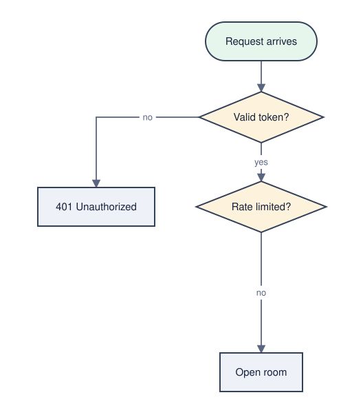
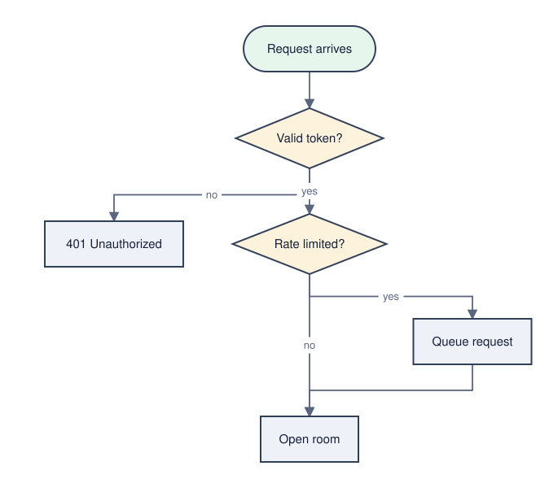
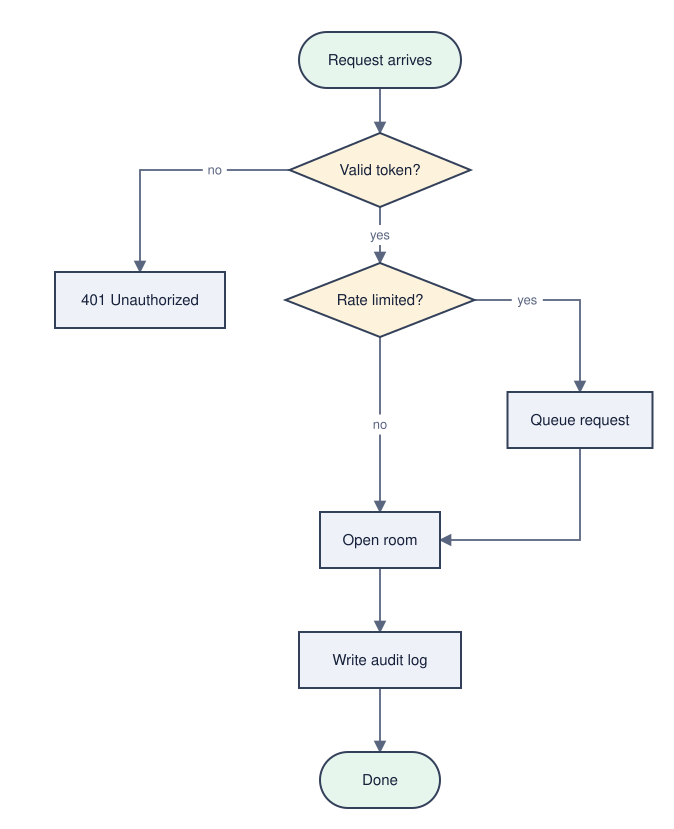

# ablauf

Text-sourced flowcharts for humans **and** LLMs.

Mermaid got half of it right: a flowchart should be a few lines of semantic
text — nodes, edges, labels — that a language model can write, diff, and
review. What it got wrong is layout: 100% algorithmic, so a human has no
handle to grab, and one added node reshuffles the whole chart. Canvas tools
(Whimsical, tldraw) are the mirror image: layout is 100% manual and feels
great, but there is no compact text a model could author.

ablauf keeps the two concerns in two places:

```
flowchart TD
  start([Request arrives]) --> check{Valid token?}
  check -->|no| reject[401 Unauthorized]
  check -->|yes| rate{Rate limited?}
  rate -->|no| allow[Open room]
```

```json
{ "version": 1, "nodes": {
  "start":  { "x": 380, "y":  60 },
  "check":  { "x": 380, "y": 170 },
  "reject": { "x": 140, "y": 300 },
  "rate":   { "x": 380, "y": 300 },
  "allow":  { "x": 380, "y": 540 }
} }
```

That pair — semantic text plus a positions sidecar — is all the renderer
consumes. The two blocks above, rendered:

<p align="center">
  <picture>
    <source media="(prefers-color-scheme: dark)" srcset="docs/assets/readme-v1-dark.svg">
    
  </picture>
</p>

- The **semantic text** is a strict mermaid-flowchart subset — every LLM
  already speaks it, and the file renders as plain mermaid anywhere ablauf
  isn't installed. ablauf never rewrites it to store geometry.
- The **layout store** is positions by stable node id, kept *outside* the
  text: a JSON sidecar for plain hosts, a `Y.Map` in a CRDT host like
  uberblick. A drag writes the store, not the source, so it can't invalidate
  a concurrent agent edit to the text.
- **Rendering is deterministic.** Same text plus same store, same SVG, on
  every replica, byte for byte. There is no layout engine and no model in
  the render path.

## How layout survives an edit

The hard problem in this space is not drawing the chart, it is *not
scrambling it* when the text changes. ablauf's answer is a rule, not an
algorithm:

1. **Freeze.** Every node whose id already has a position keeps it exactly.
   Not "approximately", not "as a strong preference" — verbatim, enforced by
   the pipeline.
2. **Direct.** Only genuinely new or explicitly named nodes get placed, from
   a small vocabulary of coarse directives (`{ id, rel: { of, dir, steps } }`,
   `delta`, `cell`, `at`). Whoever edits the meaning — a human, an agent, your
   own LLM session — emits directives for what they added.
3. **Snap.** A deterministic validation pass turns directives into
   coordinates: grid snap, no overlaps, no negative space, unknown ids
   rejected with a warning. Nothing a directive set can say will move a
   frozen node, overlap two boxes, or push anything off-canvas — those are
   properties of the pipeline, tested as such.

Here is that rule as pictures: the chart above, then the same chart after two
edits — a retry queue put beside the rate limiter, taking its `yes` branch in
from the side and looping back up to where requests arrive, then an audit trail
appended at the bottom. Each edit adds nodes and edges to the text and places
only the new nodes, with one directive apiece:

| v1 — the base chart | v2 — retry queue added | v3 — audit trail added |
| :---: | :---: | :---: |
| <picture><source media="(prefers-color-scheme: dark)" srcset="docs/assets/readme-v1-dark.svg"></picture> | <picture><source media="(prefers-color-scheme: dark)" srcset="docs/assets/readme-v2-dark.svg"></picture> | <picture><source media="(prefers-color-scheme: dark)" srcset="docs/assets/readme-v3-dark.svg"></picture> |

The promise **across** versions of a chart is deliberately not byte-equality —
the canvas grows (v2 is 178px wider than v1, v3 another 240px taller), new
nodes and edges appear. It is *recognizability*: every node that existed
before is drawn at exactly the coordinates it had, so the chart your reader
learned last week is still the chart they see this week, just with more on it.
Byte-equality is the promise **within** a version: same text plus same store
renders the same SVG, byte for byte, on every replica. These images are
generated by [`scripts/readme-images.mjs`](scripts/readme-images.mjs) from the
example blocks above — the script fails rather than write a frame in which a
pre-existing node moved.

Step 2 is where quality lives and step 1 is where safety lives, which is why
they are separate. A measurement spike behind this design showed why:
freezing alone gives 0px drift on unchanged nodes across 12 graph mutations,
and the placement of *new* nodes is the only part a model actually improves.
ablauf ships steps 1 and 3 as code; step 2 is a written procedure any LLM
session can follow —
[`agent/layout-preserving-edit.md`](agent/layout-preserving-edit.md). No model
dependency, no API key, no inference cost in the library.

## What was tried and rejected

Two ideas from this project's first charter are dead, and the reasoning is
worth keeping (recorded in [`docs/decisions.md`](docs/decisions.md)):

- **Auto-layout around pinned nodes with elkjs.** Not possible at any
  configuration — ELK's `INTERACTIVE` strategies treat coordinates as
  *ordering* hints, and the maintainer's answer to this exact request is
  "No, this is not possible". Only `cytoscape-fcose` and `d3-force` honor
  exact pins in JS, and neither draws a layered flowchart. D2's TALA is the
  one engine that bridges it, and it is proprietary.
- **Layout hints as `%% @pos` comments inside the block text.** LikeC4
  shipped exactly this and retracted it. In a CRDT host it is worse than
  cosmetic: a drag rewrites the block, which invalidates every in-flight
  agent edit through whole-block revision checks. `%% @pos` survives as an
  *export* format only.

## Scope

Flowcharts only. The core is framework-agnostic and dependency-free — parser,
serializer, layout store, snap pass, SVG renderer. Host adapters (Tiptap,
React) are deliberately not part of v1: the host-integration contract in
[`docs/spec/layout-store.md`](docs/spec/layout-store.md) is small enough to
implement directly, and `demo/` is a complete worked example. The core knows
nothing about any consuming product: no sync, no CRDTs, no storage.

## Trying it

```
mise run demo        # build + serve the drag demo (drag a node; everything else stays put)
mise run acceptance  # the end-to-end gate + a gallery: the legibility ladder, then the twelve spike scenarios
```

## Status

v1: parser/serializer, layout store + snap pass, deterministic SVG renderer,
drag demo, acceptance gate. Design decisions and their reasons live in
[`docs/decisions.md`](docs/decisions.md). MIT.
