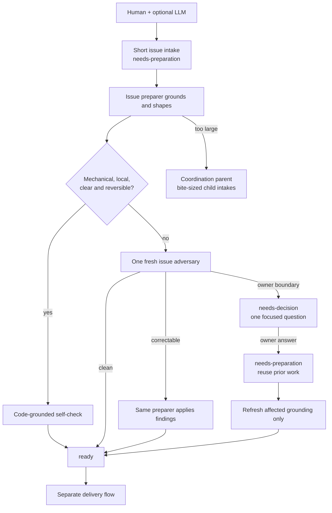
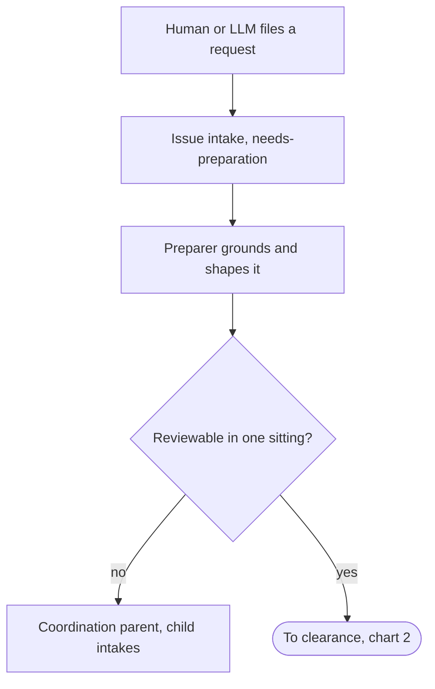
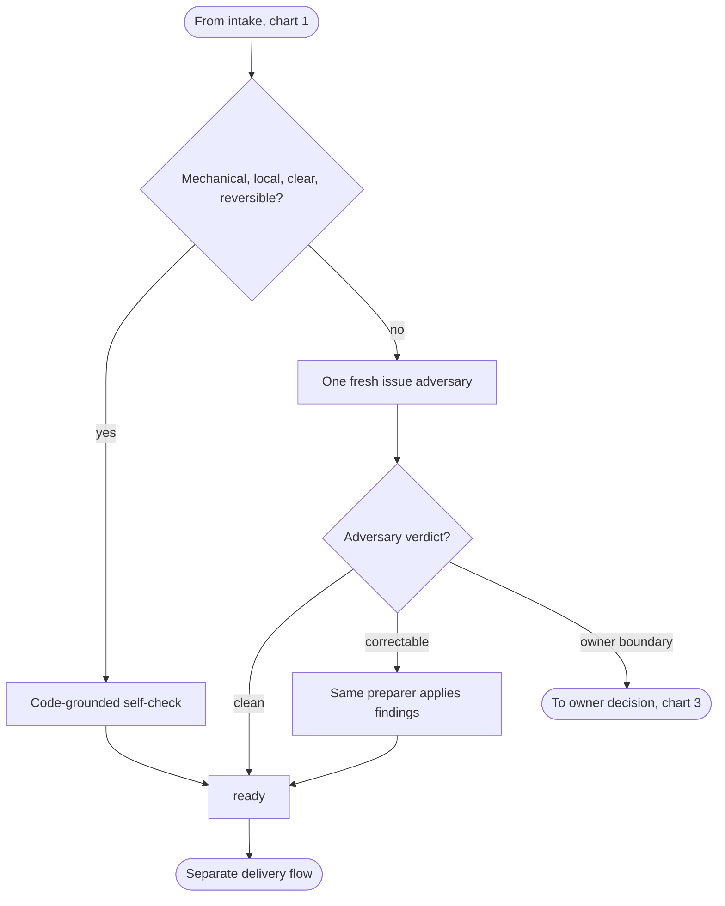
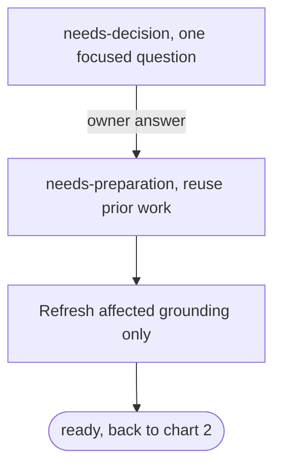
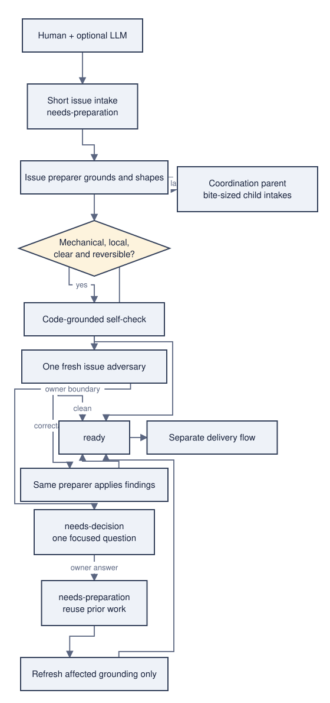
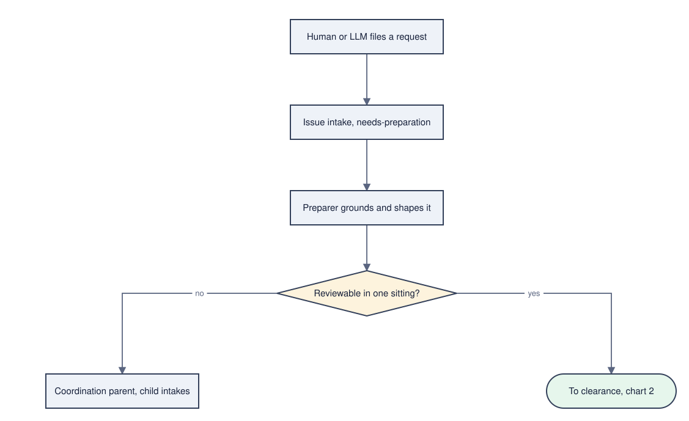
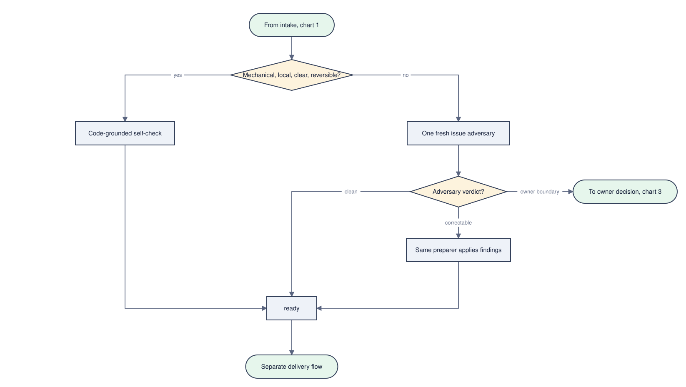
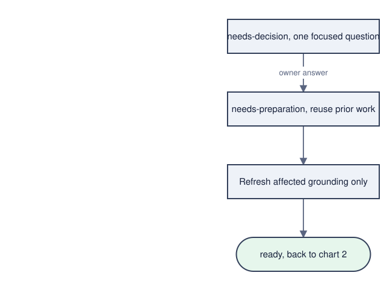

# Shaping a dense chart into readable ones

**Status:** a spike. It proposes an agent procedure and works it through one
real chart; nothing here is shipped, and `agent/` is unchanged
([issue #57](https://github.com/uberblick-ai/ablauf/issues/57)).
**Written:** 2026-08-31, against `2dfa042` — after
[#56](https://github.com/uberblick-ai/ablauf/issues/56) made a `<br/>` label
render as multiline text, which §2's rule 5 and §5's first measurement are
written against.

[`../../agent/layout-preserving-edit.md`](../../agent/layout-preserving-edit.md)
teaches a session how to change a chart's meaning without disturbing its
layout. It says nothing about a chart whose *source* mixes several narratives —
one that is dense, not wrong. This is the missing layer: when to decompose such
a chart, into what, and how to prove the decomposition kept every path.

It is agent guidance and an output contract, not runtime layout. ablauf already
draws a decision's binary outcomes from opposite vertices **when the supplied
positions put its targets on opposite sides** — geometric, never label-based
([`../decisions.md`](../decisions.md) D23). Nothing below asks the library to
get smarter.

## 1. A separate procedure, not an extension

**Recommendation: a second file in the pack, not more of
`layout-preserving-edit`.** Four reasons, in order of weight:

- **The central promise differs.** `layout-preserving-edit` exists to say *this
  node does not move* — D6's freeze rule, stated for a reader. Shaping starts
  from an empty store for each new chart, where there is nothing to freeze. Two
  contracts in one file weakens the one that matters most.
- **The trigger differs.** Layout-preserving editing runs on **every** edit.
  Shaping runs when a chart has been measured and found dense, which is rare
  and deliberate. A procedure read on every edit should not carry a section
  that almost never applies.
- **The signature differs.** One chart in, one edit plus a directive list out —
  against one chart in, *several* charts out, each with its own text, its own
  store, and a coverage proof. Different inputs, different outputs.
- **They compose.** Shaping ends by handing each new chart to
  `layout-preserving-edit` for every edit that follows. It sits above that
  procedure, not inside it.

### Inputs

One chart: its semantic source, and its layout store if it has one. Nothing
else — no image, no model, no repository access.

### Outputs

- **Two or more charts.** Each is a semantic source in the mermaid subset, plus
  the directive set that places its nodes — `cell` for the one node that starts
  a chart, `rel` off an already-placed node for every other. Positions come back
  from `snap`; the procedure never writes a coordinate it computed itself. `at`
  stays what D7 makes it, a pixel escape hatch for a drag, and the worked case
  below needed none.
- **A coverage inventory.** Every source node, every source edge and every
  branch outcome mapped onto the results, with cross-chart handoffs and
  deliberate duplicates named, and the source meaning of every shortened label
  recorded. §4 is the worked one.
- **The rubric numbers** of §5 for each result.

### Trigger conditions

Measured, not felt. Any one of these fires:

1. **Cold start could not seat the graph.** `snap(graph, {}, [])` returns a
   `displaced` warning: the fallback placer found a node's requested point
   occupied and had to shove it somewhere else. `min-clamped` is deliberately
   **not** part of this trigger. It is a property of the origin cell, not of the
   graph: the fallback seats a root at `ORIGIN` `(100, 60)` and every movable
   node clamps to `x >= MARGIN + w/2`, so any root whose label reaches 15
   characters — a box wider than 160px — clamps. The two-node control
   `A[A modest process box] --> B[Done]` cold-starts with one `min-clamped`
   warning while having zero crossings, zero retraces, no hidden decision and a
   263 × 229 canvas. A signal that a clean two-node chart trips is not a density
   signal.
2. **The drawing has defects.** The rendered SVG has an edge crossing a box
   interior, or two edges drawn as one line outside D23's trunk exemption.
3. **A decision is drawn as a box.** Some non-`decision` node has more than one
   outbound edge and at least one of them is labelled.
4. **The canvas is out of proportion.** `svgMeta`'s `width / height` is **below
   0.5 or above 2.0** — a column so tall, or a band so wide, that it cannot be
   read at one zoom level. The bound is exact, and the boundary values
   themselves do not fire, so two sessions measuring one chart get one answer.

None firing is the answer "this chart is fine": the procedure stops there.

### Boundaries

- It never moves a node in the source chart, and never edits the source
  chart's store. The original is left exactly as it was.
- It never hands a chart a coordinate of its own. Placement is expressed as
  directives and resolved by `snap` (D7), and the coarse forms carry it: one
  `cell` per chart and `rel` for everything else. `at` remains D7's pixel escape
  hatch for a drag — available, and not this procedure's vocabulary.
- It never reads meaning out of a label. A branch is expressed by **placing**
  its targets; D23 turns that into vertices. Sniffing `yes`/`no` was rejected
  once already and is not reintroduced here.
- It never changes what the chart says. Every node, edge and branch outcome
  lands somewhere, and the inventory is what proves it.
- It is not automatic. A session runs the triggers; a human decides to shape.

## 2. The procedure

1. **Measure first.** Run the four triggers of §1 and record the numbers. If
   none fires, stop.
2. **Name the narratives.** One narrative answers one question. Cut where a
   reader would say *and then a different thing happens* — at a park, a
   terminal state, or a handoff to another actor. One chart per narrative.
3. **Cut at handoffs, and draw both ends.** Every cut becomes two drawn ends: a
   terminal in the upstream chart naming the downstream one, and an entry in the
   downstream chart. Both ends go in the handoff table, and a cut is never
   recorded as duplicated content. The one exception is a cut that **re-enters a
   state the downstream chart already draws**: its downstream end is that node
   itself rather than a second stub beside it, because two nodes carrying one
   word in one chart is the duplication this rule exists against. It is still a
   cut, and it is still recorded as one — the chart-3 → 2 return in §4 is the
   worked instance.
4. **Make every hidden decision a diamond.** A process box with several
   outbound edges, at least one labelled, *is* a decision. Give it a diamond
   whose text is the question and hang the labelled exits off that. A chart
   with no decision needs no diamond; the rule is that decisions are never
   drawn as boxes, not that every chart must branch.
5. **Shorten labels to one line, and write down what you dropped.** A `<br/>`
   label renders properly since #56, so this is no longer about a defect: a
   two-line label is a taller box, and it is usually a node doing two jobs.
   Break the node or shorten the words; keep the marker only where two lines
   genuinely read better. Every changed label goes in the inventory with its
   source meaning.
6. **Place binary branch targets on opposite sides.** One row below the
   diamond, one target left of its centre and one right — that, and nothing
   else, is what makes the branch read as a choice. A three-way exit takes
   left, right and straight below.
7. **Run `snap`, then re-measure.** Zero warnings and zero drawn defects, on
   every chart, in both themes. Iterate on *placement*: a label is shortened in
   step 5 because it says too much, never to make a box fit a gap.
8. **Prove coverage before handing it over.** The inventory is the deliverable
   that catches a severed path — the failure mode decomposition actually has.

## 3. The worked case

The source is this repository's own issue-review workflow: 13 nodes, 15 edges,
one chart.



All four triggers fire, with no judgement involved:

- **Cold start:** `displaced` on `A`, `C`, `D`, `U`, `E` — five nodes the
  fallback could not seat where it wanted them. (Two more warnings, `min-clamped`
  on `H` and `P`, are the origin-cell effect trigger 1 excludes; seven in total,
  five of them the trigger.)
- **Drawn defects:** five segments through a box interior, two pairs of edges
  drawn as one line.
- **Hidden decisions:** `P` and `A`.
- **Canvas:** 560 × 1189, ratio 0.47.

The branch defect is worth stating exactly, because it is the one this
procedure is really about. `T` is the only diamond in the chart, and at
(160, 420) its box spans x 32–288, y 373–467. Its `yes` edge leaves at
(117.3, 451.3) and its `no` edge at (202.7, 451.3): **both outcomes leave the
same face**, 85.4px apart on the two slopes either side of the bottom vertex,
because both targets sit straight below it. The picture does not say a choice
was made. Nothing is wrong with the router — D23 gave both endpoints the only
side that faces their counterpart, and fanned them onto it. The positions are
what failed to express the branch.

### The three charts

**Chart 1 — intake and sizing.** *How does a request become one prepared-size
issue?*



```json
[ { "id": "author",    "cell": { "col": 2, "row": 0 } },
  { "id": "intake",    "rel": { "of": "author", "dir": "below" } },
  { "id": "prep",      "rel": { "of": "intake", "dir": "below" } },
  { "id": "fits",      "rel": { "of": "prep",   "dir": "below" } },
  { "id": "parent",    "rel": { "of": "fits",   "dir": "below-left" } },
  { "id": "clearance", "rel": { "of": "fits",   "dir": "below-right" } } ]
```

**Chart 2 — clearance to ready.** *How does a shaped issue earn `ready`?*



```json
[ { "id": "shaped",    "cell": { "col": 3, "row": 0 } },
  { "id": "trivial",   "rel": { "of": "shaped",  "dir": "below" } },
  { "id": "selfcheck", "rel": { "of": "trivial", "dir": "below-left" } },
  { "id": "adversary", "rel": { "of": "trivial", "dir": "below-right" } },
  { "id": "verdict",   "rel": { "of": "adversary", "dir": "below" } },
  { "id": "parked",    "rel": { "of": "verdict", "dir": "right", "steps": 2 } },
  { "id": "applyfix",  "rel": { "of": "verdict", "dir": "below" } },
  { "id": "ready",     "rel": { "of": "applyfix", "dir": "below-left" } },
  { "id": "delivery",  "rel": { "of": "ready",   "dir": "below" } } ]
```

**Chart 3 — owner decision and return.** *What happens to a parked question?*



```json
[ { "id": "parked",   "cell": { "col": 2, "row": 0 } },
  { "id": "requeued", "rel": { "of": "parked",   "dir": "below" } },
  { "id": "refresh",  "rel": { "of": "requeued", "dir": "below" } },
  { "id": "ready",    "rel": { "of": "refresh",  "dir": "below" } } ]
```

Chart 3 has no decision, so it has no diamond. That is rule 4 read as written:
a decision is never drawn as a box, and a chart with no branch does not need
one invented for it.

**Every position in these three charts came out of `snap`.** Each list is the third
argument of `snap(parse(source), {}, directives)` against an **empty** store, so
every node is movable and nothing is frozen: one `cell` seats the chart's first
node and every other node hangs off one already placed, which is the whole
coarse vocabulary D7 asks for. The three calls return **zero warnings**, and the
coordinates they return are what §5 measures and what drew the SVGs — not
written here, because a derivable number stored beside its source is a number
that rots.

One `steps` value is not 1, and it is step 7 doing its job: `parked` one column
right of `verdict` lands on the box beside it and comes back `displaced`, so it
goes two. That is the whole iteration loop — the placement moved, the label did
not.

### Both observations, for each chart

**Valid mermaid.** mermaid 11.17.2 was installed in this run's scratch and
asked to `parse` and `render` each source *unchanged* — the same bytes, no
adaptation. All four sources, the original included, parse; all four render,
and the graph mermaid builds has the same counts ablauf's `parse` returns:
13/15, 6/5, 9/10, 4/3 nodes and edges. The render ran under jsdom with
`getBBox` stubbed, because mermaid's renderer measures text and jsdom has no
layout engine — so mermaid's *geometry* there is meaningless and is not
claimed. What the check establishes is that mermaid accepts the source and
reads the same graph out of it; geometry lives outside the source anyway (D4),
so a picture-for-picture comparison would not mean anything.

**Warning-free in ablauf.** `parse` → `snap` → `toSvg` over the directive lists
above: **zero warnings on all three charts**, no two boxes overlapping, and
zero drawn defects in both shipped themes. The numbers are in §5.

## 4. The coverage inventory

Every source node, and where it went.

| Source | Label | Lands in | As | Label there |
|---|---|---|---|---|
| `H` | Human + optional LLM | 1 | `author` | Human or LLM files a request |
| `I` | Short issue intake `<br/>` needs-preparation | 1 | `intake` | Issue intake, needs-preparation |
| `P` | Issue preparer grounds and shapes | 1 | `prep` | Preparer grounds and shapes it |
| `U` | Coordination parent `<br/>` bite-sized child intakes | 1 | `parent` | Coordination parent, child intakes |
| `T` | Mechanical, local, `<br/>` clear and reversible? | 2 | `trivial` | Mechanical, local, clear, reversible? |
| `S` | Code-grounded self-check | 2 | `selfcheck` | unchanged |
| `A` | One fresh issue adversary | 2 | `adversary` | unchanged |
| `C` | Same preparer applies findings | 2 | `applyfix` | unchanged |
| `Y` | ready | 2 | `ready` | unchanged |
| `E` | Separate delivery flow | 2 | `delivery` | unchanged |
| `D` | needs-decision `<br/>` one focused question | 3 | `parked` | needs-decision, one focused question |
| `Q` | needs-preparation `<br/>` reuse prior work | 3 | `requeued` | needs-preparation, reuse prior work |
| `R` | Refresh affected grounding only | 3 | `refresh` | unchanged |

Every source edge. Fifteen in, fifteen accounted for.

| # | Source edge | Becomes |
|---|---|---|
| 1 | `H --> I` | 1: `author --> intake` |
| 2 | `I --> P` | 1: `intake --> prep` |
| 3 | `P --> T` | **split at the chart-1/2 cut**: 1 `fits -->\|yes\| clearance`, 2 `shaped --> trivial` |
| 4 | `P -->\|too large\| U` | 1: `fits -->\|no\| parent` |
| 5 | `T -->\|yes\| S` | 2: `trivial -->\|yes\| selfcheck` |
| 6 | `T -->\|no\| A` | 2: `trivial -->\|no\| adversary` |
| 7 | `A -->\|clean\| Y` | 2: `adversary --> verdict` then `verdict -->\|clean\| ready` |
| 8 | `A -->\|correctable\| C` | 2: `verdict -->\|correctable\| applyfix` |
| 9 | `A -->\|owner boundary\| D` | 2: `verdict -->\|owner boundary\| parked` — **the chart-2/3 cut** |
| 10 | `D -->\|owner answer\| Q` | 3: `parked -->\|owner answer\| requeued` |
| 11 | `Q --> R` | 3: `requeued --> refresh` |
| 12 | `R --> Y` | 3: `refresh --> ready` |
| 13 | `S --> Y` | 2: `selfcheck --> ready` |
| 14 | `C --> Y` | 2: `applyfix --> ready` |
| 15 | `Y --> E` | 2: `ready --> delivery` |

**And the reverse direction**, which is the half that catches a severed path.
The three results hold **18** edges (5 + 10 + 3). Seventeen are claimed by the
rows above, each exactly once. The eighteenth is `prep --> fits` in chart 1: it
has no source counterpart because it is the **stem** of the diamond rule 4
extracts out of `P`, exactly as `adversary --> verdict` (row 7) is the stem
extracted out of `A`. Two extracted nodes, two stems; neither adds meaning, and
no result edge is unaccounted for.

**Branch outcomes.** `T`'s two (`yes`, `no`) are chart 2's `trivial`. `A`'s
three settled adversary outcomes — `clean`, `correctable`, `owner boundary`
([`../../.agents/roles/issue-adversary.md`](../../.agents/roles/issue-adversary.md))
— are chart 2's `verdict`, all three drawn, including the one that leads
somewhere new. `P`'s implicit sizing choice, whose only labelled exit was
`too large`, is chart 1's `fits`.

**Cross-chart handoffs** — three cuts, each drawn from both sides:

| Cut | Upstream terminal | Downstream entry |
|---|---|---|
| chart 1 → 2 | `clearance([To clearance, chart 2])` | `shaped([From intake, chart 1])` |
| chart 2 → 3 | `parked([To owner decision, chart 3])` | `parked[needs-decision, one focused question]` |
| chart 3 → 2 | `ready([ready, back to chart 2])` | `ready[ready]`, chart 2's own state node |

The third one is the return, and it closes the loop `R --> Y --> E` opens
across the cut: a question answered in chart 3 comes back to `ready` in chart 2
and leaves through `ready --> delivery` from there. It takes rule 3's stated
exception — the downstream chart already draws that state, so the state node
*is* the entry and no stub stands beside it. Reading the two `ready` nodes as a
duplicate instead is what would leave the end-to-end return implicit, which is
why it is in this table and not below it.

**Deliberate duplicates** — **none**. Every id that appears in two charts is one
end of a cut in the table above (`parked`, `ready`), and each of those pairs is
recorded there. Nothing is copied into a second chart to save a handoff.

**Two nodes with no source counterpart**, both from rule 4: `fits` (chart 1)
and `verdict` (chart 2). Each carries the labelled exits of a source node that
was drawn as a box — `P` and `A`. They add no meaning; they relocate it.

**One thing the source does not say, and neither do the results.** `U`
(`parent`) is terminal: the source never draws the child intakes re-entering
the flow. Shaping preserved that, rather than inventing the edge. Recording the
gap is the procedure's job; closing it is the chart author's.

## 5. Eyes-on, and the rubric

Both shipped themes, one file each, the same geometry with a different palette
(D5/D21). The reader's colour scheme picks the file.

| Before — one chart, 13 nodes |
| :---: |
| <picture><source media="(prefers-color-scheme: dark)" srcset="../assets/shaping-before-dark.svg"></picture> |

| 1 — intake and sizing | 2 — clearance to ready | 3 — owner decision |
| :---: | :---: | :---: |
| <picture><source media="(prefers-color-scheme: dark)" srcset="../assets/shaping-intake-dark.svg"></picture> | <picture><source media="(prefers-color-scheme: dark)" srcset="../assets/shaping-clearance-dark.svg"></picture> | <picture><source media="(prefers-color-scheme: dark)" srcset="../assets/shaping-decision-dark.svg"></picture> |

The rubric is five measurements, each one a number a later session can
reproduce. The first four predicates already exist in this repository —
`polylines`, `cuts`, `retraces`, `trunk` and `defects` in
[`../../scripts/readme-images.mjs`](../../scripts/readme-images.mjs), which are
the same `throughBoxes` and `retraced` pins `test/render.test.ts` runs over the
goldens. Re-apply them; do not write a second copy.

| Measurement | How | Before | 1 | 2 | 3 |
|---|---|---|---|---|---|
| **Label legibility** | longest label in characters; labels drawn over two lines | 48, **5 of 13 two-line** | 34, 0 | 37, 0 | 36, 0 |
| **Branch origin** | for each diamond, which vertex each outbound edge leaves | `T`: **both exits fanned onto the bottom vertex's slopes**, (117.3, 451.3) and (202.7, 451.3) | `fits`: left / right | `trivial`: left / right; `verdict`: left / bottom / right | none |
| **Edge retracing** | `retraces` pairs, minus D23's trunk exemption | **2** | 0 | 0 | 0 |
| **Node crossings** | `cuts` — segments through a box interior | **5** | 0 | 0 | 0 |
| **Canvas proportions** | `svgMeta` `width / height` | 560 × 1189 = **0.47** | 827 × 589 = 1.40 | 1446 × 829 = 1.74 | 646 × 469 = 1.38 |
| *(and the cold start)* | `snap` warnings | **7 — 5 `displaced`, 2 `min-clamped`** | 0 | 0 | 0 |

Two notes on reading it. The five defects in *Before* include `T -> S` and
`T -> A` leaving through `T`'s own box interior, which is the fanned-anchor
case D23 describes and not a router bug. And the three results are wider than
the source is: decomposition buys proportion with width, which is the axis a
reader has.

## 6. What this needs next

Three candidate units, smallest first. None is created by this spike.

1. **Ship the procedure** as a second pack file beside
   `layout-preserving-edit.md`, with `scripts/check-agent-pack.mjs` extended to
   cover it. Blocked on where the pack lands — issue #60 may move it.
2. **Make the triggers runnable.** Lift `readme-images.mjs`'s legibility
   predicates into one shared module that the script, the render tests and a
   chart-level check all import, so the rubric of §5 is a command rather than a
   paragraph. Independently useful: it removes the third copy of `throughBoxes`.
3. **A shaped pair in the legibility ladder** — the before chart and one result
   as scenarios, so the gallery carries the comparison instead of this
   document's committed SVGs.

And the confirmation the spike owes its charter, stated plainly:

- **No runtime model dependency.** The procedure is prose the user's own
  session follows; ablauf gains nothing and imports nothing (D10).
- **No graph-aware auto-layout.** Every position above came from a directive
  through `snap`. Nothing inspected the graph to decide where a node goes (D7).
- **No label-based branch routing.** `fits`, `trivial` and `verdict` express
  their branches by where their targets sit. D23 read the geometry and never
  the words `yes`, `no`, `clean` or `owner boundary` (D4/D23).
