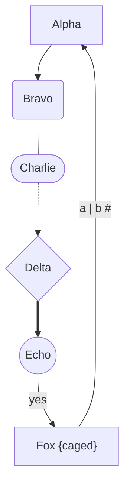

# The ablauf text format

Normative for v1. ablauf text is a strict subset of mermaid's flowchart
grammar, so any ablauf file renders unchanged in any mermaid renderer. The
subset is strict in both directions: ablauf rejects everything it does not
implement, with a line, a column and a named construct, rather than guessing.
A chart therefore never quietly means something other than what it says.

Geometry is not part of this format. Positions live in the layout store, keyed
by node id ([D4](../decisions.md)); ablauf never rewrites the text to record
geometry, and there is no position syntax to parse.

## Node identity

**A node's id is the layout key.** Renaming an id is not a rename: it declares
a new node, and the position stored under the old id is orphaned. Nothing in
the format tracks a node across an id change and no heuristic recovers one
([D12](../decisions.md)).

Labels are content, ids are identity. An editor — human or model — that wants
to reword a node changes its label and leaves the id alone; a tool that
regenerates ids on every edit throws the layout away every time.

## Determinism

`parse` is a pure function of its input text. `nodes` is in first-appearance
order (the position of the id's first mention anywhere in the text, whether
declared with a shape or referenced bare); `edges` is in source order, with
chains and `&` groups expanded in place. The same text always yields an equal
graph — nothing is sorted, hashed, or iterated out of a map.

## Statements

One statement per line; blank lines are ignored. A line whose first non-space
characters are `%%` is a comment and is skipped whole. `%%` does not start a
comment in the middle of a statement: `A --> B %% note` is an error, not an
edge.

Whitespace between tokens is optional (`A-->B` is legal) except that a shape
must follow its id with no space between them (`A [x]` is not a declaration).
Ids are case-sensitive.

### Header

The first statement is the header:

```
flowchart TD
graph LR
flowchart
```

`flowchart` and `graph` are interchangeable on input; the serializer always
emits `flowchart`. The direction is one of `TD`, `TB`, `LR`, `RL`, `BT`, and
defaults to `TD` when omitted. `TB` and `TD` both mean top-to-bottom; ablauf
keeps whichever was written rather than normalising, so a round-trip does not
edit the header.

### Nodes

A declaration is an id, then a shape carrying the label:

| Shape     | Syntax        | `kind`     |
| --------- | ------------- | ---------- |
| process   | `id[label]`   | `process`  |
| rounded   | `id(label)`   | `rounded`  |
| stadium   | `id([label])` | `stadium`  |
| decision  | `id{label}`   | `decision` |
| circle    | `id((label))` | `circle`   |

Ids match `[A-Za-z_][A-Za-z0-9_-]*[A-Za-z0-9_]`, or a single `[A-Za-z_]`. A
hyphen belongs to the id only when a name character follows it, which is what
keeps `a-b` one id while `a-->b` is an id, a connector and another id — and why
an id never ends in `-`: nothing tells a trailing hyphen apart from the start
of an edge. The parser and the serializer share one predicate for this, so
every id the serializer emits is one the parser reads back whole.

mermaid's statement keywords are not legal ids, though they match that pattern:
`end`, `subgraph`, `style`, `classDef`, `class`, `linkStyle`, `click`,
`direction`, `graph` and `flowchart`. mermaid reads each of them as a statement
wherever it appears, so `A --> end` is not a chart with a node called `end`;
ablauf rejects them in id position rather than emitting text that means
something else in a mermaid renderer.

A declaration may appear anywhere the id may appear, including inside an edge
(`A[Start] --> B{Ok?}`). An id is declared with a shape and a label once.
Repeating that declaration identically (`A[One]` on two lines) is permitted and
says nothing new; declaring the same id with a different shape or a different
label is an error — see [Rejected constructs](#rejected-constructs) — because
the alternative is silently dropping one of the two labels. Referencing an id
bare (`A --> C`) is how it is reused; a bare id that is never declared is a
process node whose label is the id.

### Edges

| Connector | `style`  | Meaning                |
| --------- | -------- | ---------------------- |
| `-->`     | `arrow`  | arrow                  |
| `---`     | `open`   | line, no arrowhead     |
| `-.->`    | `dotted` | dotted arrow           |
| `==>`     | `thick`  | thick arrow            |

Exactly these four spellings. mermaid's length-carrying variants (`---->`,
`====>`) are not supported and fail as an unparsable statement.

An edge label may be written in either mermaid spelling, never both on one
edge:

```
A -->|yes| B
A -- yes --> B
A -. maybe .-> B
A == fast ==> B
A --- plain --- B
```

The serializer always emits the `|label|` spelling.

### Chains and `&` groups

A statement may chain any number of edges, and either side of a connector may
be an `&` group. Both are expanded to one edge per pair, in place:

```
A --> B --> C          A-->B, B-->C
A & B --> C            A-->C, B-->C
A --> B & C            A-->B, A-->C
A & B --> C & D        A-->C, A-->D, B-->C, B-->D
```

The group expansion order is left-hand member outer, right-hand member inner,
as shown. Each connector carries its own label: `A -->|1| B -->|2| C`.

### Labels

A label is bare text or a double-quoted string. Bare text runs to the closing
delimiter and is trimmed; quote a label that contains a delimiter (`]`, `)`,
`}`, `|`, `%%`) or leading and trailing space that matters:

```
F["Fox [caged]"]
F -->|"[1] see below"| G
```

A bare label carrying `%%`, a raw `|`, or a stray shape delimiter
(`A[x %% y]`, `A[x|y]`, `A([x]y])`) is an error rather than a guess: a mermaid
renderer would close the shape, or the edge label, somewhere else. Quote it.

A quoted label runs to the next `"`; there is no backslash escape. `"`, `|` and
`#` inside a label are written with the three mermaid entity escapes `#quot;`,
`#124;` and `#35;`, which the parser decodes in every label, bare or quoted,
and which the serializer emits when it has to. Those three are the whole set:
any other `#…;` entity form (`#9829;`, `#semi;`) is rejected, not passed
through, because ablauf would carry the source text while a mermaid renderer
showed the character it names.

A bare label may not be empty (`A[]` is an error). `A[""]` is an empty label,
and round-trips as one.

## Emitted constructs

This is the serializer's entire vocabulary — every line it can produce, and the
mermaid syntax it produces it in. A test asserts that the output for the
canonical graph below is exactly the second column of this table, so the table
cannot drift away from the code.

| Construct           | Emitted syntax                | Notes                                                      |
| ------------------- | ----------------------------- | ---------------------------------------------------------- |
| header              | `flowchart TD`                | always `flowchart`, direction verbatim                      |
| process node        | `A[Alpha]`                    | one declaration per line, in `nodes` order                  |
| rounded node        | `B(Bravo)`                    |                                                             |
| stadium node        | `C([Charlie])`                |                                                             |
| decision node       | `D{Delta}`                    |                                                             |
| circle node         | `E((Echo))`                   |                                                             |
| quoted label        | `F["Fox {caged}"]`            | quoted because the label contains a delimiter               |
| arrow edge          | `A --> B`                     | one edge per line, in `edges` order                         |
| open edge           | `B --- C`                     |                                                             |
| dotted edge         | `C -.-> D`                    |                                                             |
| thick edge          | `D ==> E`                     |                                                             |
| labelled edge       | `E -->\|yes\| F`              | always the `\|label\|` spelling, never `-- yes -->`         |
| escaped label       | `F -->\|"a #124; b #35;"\| A` | entity escapes for `\|`, `"` and `#`, then quoted            |

Chains, `&` groups, bare id references, `graph`, the `-- text -->` spelling and
comments are input-only: they parse, but the serializer never emits them.

### Canonical output



Node declarations come first, then edges. Declaring every node on its own line
is redundant in hand-written mermaid, but it keeps the output one construct per
line and it is the only spelling that can express an isolated node.

## Round-trip

The round-trip is semantic, not byte-for-byte ([D13](../decisions.md)):

- `parse(serialize(g))` equals `g` for any graph `g` this parser can produce.
- `serialize` is idempotent through a parse:
  `serialize(parse(serialize(g))) === serialize(g)`.
- `serialize(parse(text))` normalises `text` — `graph` becomes `flowchart`,
  chains and `&` groups are expanded, edge labels move to the `|label|`
  spelling, declarations are hoisted, comments and indentation are dropped.

That normalisation is safe only because serialization is an export path.
ablauf never writes a serialized graph back over a human's source.

## Rejected constructs

Every rejection is a thrown `ParseError`, never a warning, a repair, or a
crash. One error at a time — the first one wins. This table is the contract:
a test covers every row, asserting the construct and the line.

| Construct            | Example                          | Why, and what to write instead                                                     |
| -------------------- | -------------------------------- | ---------------------------------------------------------------------------------- |
| `missing-header`     | `A --> B` as the first statement | ablauf needs the direction; open with `flowchart TD`                                |
| `header`             | `flowchart TD A --> B`           | the header line takes only a direction; start the chart on the next line            |
| `bad-direction`      | `flowchart XX`                   | only `TD`, `TB`, `LR`, `RL`, `BT`                                                   |
| `semicolon`          | `A --> B;`                       | one statement per line; `;` separators are not supported                            |
| `init`               | `%%{init: {"theme":"dark"}}%%`   | ablauf takes no configuration from the text                                         |
| `subgraph`           | `subgraph one`                   | no clusters in v1; a half-supported cluster would move nodes ablauf must not move    |
| `end`                | `end`                            | closes a `subgraph`, which is not supported                                         |
| `style`              | `style A fill:#f00`              | appearance comes from the shape, not the text                                        |
| `classDef`           | `classDef big font-size:20px`    | appearance comes from the shape, not the text                                        |
| `class`              | `class A big`                    | appearance comes from the shape, not the text                                        |
| `linkStyle`          | `linkStyle 0 stroke:#f00`        | appearance comes from the connector                                                  |
| `click`              | `click A "https://example.com"`  | the text carries semantics only, no interaction                                      |
| `direction`          | `direction LR`                   | only meaningful inside a `subgraph`; set it in the header                             |
| `unknown-shape`      | `A[[Sub]]`                       | one of the five shapes; `[[…]]`, `[/…/]`, `[(…)]`, `{{…}}`, `>…]`, `@{…}` are out    |
| `bad-id`             | `1bad --> B`                     | ids match `[A-Za-z_][A-Za-z0-9_-]*[A-Za-z0-9_]`, never end in `-`, and are not keywords |
| `duplicate-node`     | `A[One]` then `A(One)`           | an identical re-declaration is fine; a conflicting one would drop a label            |
| `empty-label`        | `A[]`                            | a bare label needs text; write `A[""]` for a deliberately empty one                  |
| `unterminated-label` | `A[One`                          | close the shape (and the quotes) on the same line                                    |
| `bare-label`         | `A[x %% y]`                      | a bare label carries no `%%` and no stray `]`, `)` or `}`; quote it                  |
| `bare-label`         | `A[x\|y]`                        | a bare label carries no raw `\|` either; quote it or write `#124;`                    |
| `entity`             | `A[#9829;]`                      | only `#quot;`, `#124;` and `#35;` are decoded; other entity forms are out            |
| `edge`               | `A -- yes -->\|no\| B`           | one label per edge, and an opened `--`/`-.`/`==` label must be closed                 |
| `unparsable-line`    | `A --> B C`                      | a statement is a node declaration or a chain of edges                                |

## Errors

`ParseError extends Error`:

| Field       | Meaning                                                       |
| ----------- | ------------------------------------------------------------- |
| `line`      | 1-based line of the offending construct                       |
| `column`    | 1-based column of the offending construct                     |
| `construct` | the slug from the table above, stable for programmatic use     |
| `message`   | `line <line>:<column>: <sentence naming the construct>`       |

Branch on `construct`; show `message`.
